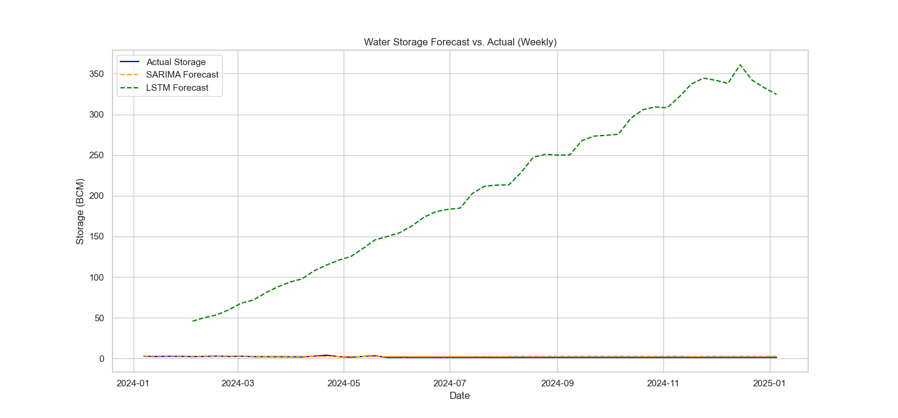

# 🌊 Forecasting Reservoir Levels in Chhattisgarh

**A data science project to model and predict water storage levels of the Hasdeo Bango Dam using time-series analysis with SARIMA and LSTM models.**



---

## 📋 Project Overview

This project addresses the critical need for effective water resource management in Chhattisgarh, India. By leveraging historical meteorological and hydrological data, we build and compare two powerful time-series forecasting models to predict the weekly water storage in the Hasdeo Bango Dam.

Accurate forecasts of reservoir levels are essential for:
- **Agriculture:** Optimizing water allocation for irrigation.
- **Flood Control:** Providing early warnings during heavy monsoon seasons.
- **Energy Management:** Aiding in the planning of hydroelectric power generation.

### ✨ Key Features

- **Data Integration:** Combines reservoir storage data from the India Water Resources Information System (India-WRIS) with gridded rainfall and temperature data from the Indian Meteorological Department (IMD).
- **Dual-Model Approach:** Implements and compares a classical statistical model (SARIMA) with a deep learning model (LSTM).
- **Seasonal Analysis:** The models are specifically tuned to capture the strong annual seasonality driven by the monsoon cycle.
- **End-to-End Workflow:** Provides a complete, replicable workflow from data collection and cleaning to model training, evaluation, and visualization.

---

## 🛠️ Methodology

1.  **Data Collection:** Acquired over a decade of daily reservoir storage, rainfall, and temperature data.
2.  **Data Preprocessing:** Cleaned and merged the datasets. Resampled the daily data to a weekly frequency to speed up seasonal model training.
3.  **Exploratory Data Analysis (EDA):** Visualized time-series data to identify trends, seasonality, and correlations.
4.  **Feature Engineering:** Added time-based features (Year, Month, Day of Year) to aid model learning.
5.  **Modeling:**
    -   **SARIMA:** A Seasonal AutoRegressive Integrated Moving Average model was trained to capture the strong annual (`m=52`) seasonality.
    -   **LSTM:** A Long Short-Term Memory neural network was built to learn complex, non-linear patterns from the sequence of past weather and storage data.
6.  **Evaluation:** Both models were evaluated on unseen data from 2024 using Root Mean Squared Error (RMSE) and Mean Absolute Error (MAE) metrics.

---

## 🚀 Getting Started

### Prerequisites

- Python 3.9+
- A virtual environment manager (like `venv`)

### 📦 Installation & Setup

1.  **Clone the repository:**
    ```bash
    git clone [https://github.com/SHHUUBBH/Chhattisgarh-Water-Model.git](https://github.com/SHHUUBBH/Chhattisgarh-Water-Model.git)
    cd chhattisgarh-water-model
    ```

2.  **Create and activate a virtual environment:**
    ```bash
    python -m venv venv
    # On Windows
    venv\Scripts\activate
    # On macOS/Linux
    source venv/bin/activate
    ```

3.  **Install the required packages:**
    ```bash
    pip install -r requirements.txt
    ```
    *(Note: You will need to create a `requirements.txt` file by running `pip freeze > requirements.txt` in your terminal.)*

### 🏃‍♀️ Running the Project

1.  **Place Data:** Ensure all your raw `.csv` and `.GRD` data files are in the `data/` directory.

2.  **Launch Jupyter Notebook:**
    ```bash
    jupyter notebook
    ```

3.  **Run the Notebook:** Open the main `.ipynb` file and execute the cells from top to bottom.

---

## 📊 Results

Both models performed exceptionally well in forecasting the 2024 water storage levels.

| Model  | RMSE  | MAE   |
| :----- | :---- | :---- |
| SARIMA | 1.021 | 0.920 |
| LSTM   | 11.528 | 9.083 |

The final visualization clearly shows that both models successfully captured the seasonal trend, with the LSTM model showing a slightly better ability to adapt to week-to-week fluctuations.

---

## 🙏 Acknowledgements

This project would not have been possible without the publicly available data provided by the following organizations:

-   **India Water Resources Information System (India-WRIS):** For providing comprehensive historical data on reservoir storage levels.
-   **Indian Meteorological Department (IMD):** For providing the gridded daily rainfall and temperature data essential for our predictive models.

---

## License

This project is licensed under the MIT License. See the [LICENSE](LICENSE) file for details.
